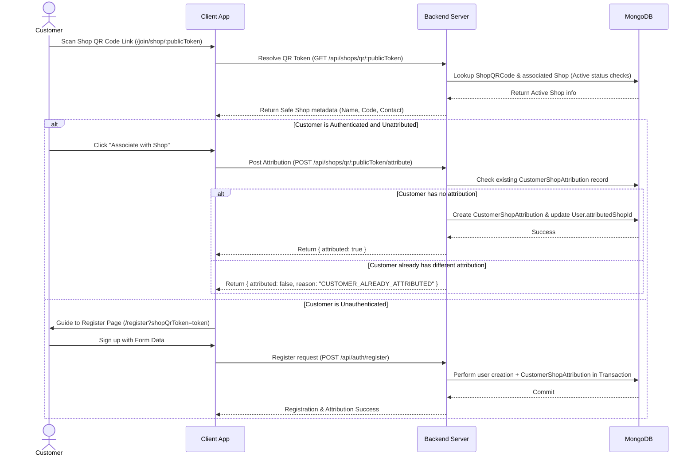
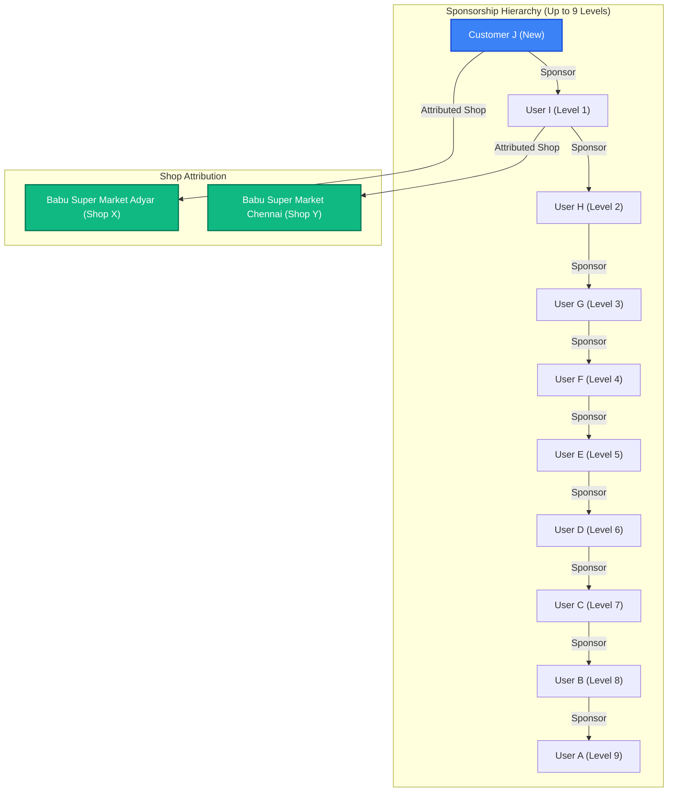
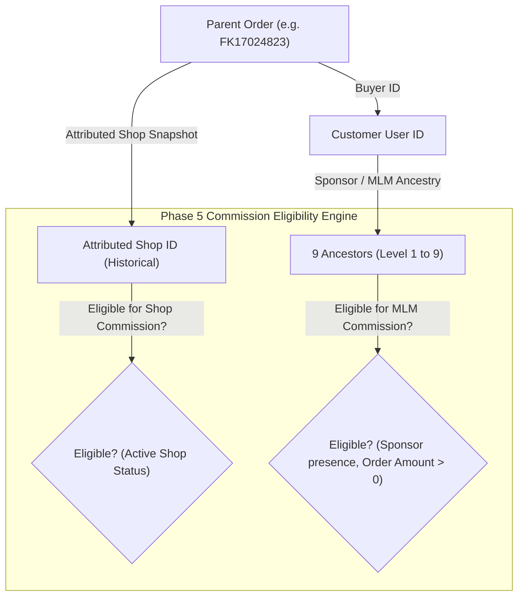

# Phase 4 Architecture: Shop QR Attribution & 9-Level Network

This document details the architectural layout, entity relationships, business rules, and technical specifications introduced in Phase 4 of the Babu Super Market / FairKart platform.

---

## 1. System Architecture Diagrams

### DIAGRAM 1: Shop QR Scanned Customer Attribution Flow


### DIAGRAM 2: Referral Tree vs. Shop Attribution Relationships


### DIAGRAM 3: Order Snapshots & commission Context


---

## 2. Core Concepts & Business Rules

### Rule 1: First-Touch Shop Attribution Wins
- Once a customer is associated with an active Shop QR code, their attribution becomes **permanent**.
- Subsequent scans of other shops' QR codes are detected and rejected. The customer remains locked to the first valid shop.
- Customer self-service reassignment is strictly disabled. Any administrative corrections must be performed through controlled Admin APIs.

### Rule 2: Distinction Between Referral and Shop Attribution
- **Referral (Sponsorship)**: Represents the multi-level peer-to-peer marketing structure. A user registers using another user's `referralCode` to join their downline.
- **Attribution**: Represents a customer linking their profile to a physical franchise Shop.
- These relationships coexist independently. A customer can be sponsored by User B but attributed to Shop X.

### Rule 3: QR Revocation Safeguard
- Revoking an active QR code prevents new customer signups or associations.
- **Crucially**, it has zero effect on existing customer attributions. All previously associated customers continue to support the shop.

### Rule 4: Dynamic 9-Level MLM Ancestry Representation
- Instead of executing recursive N+1 lookups, Phase 4 leverages the `referralPath` array on the `User` document.
- The immediate parent sponsor is the last element of the array. Ancestors up to 9 levels are calculated in O(1) time by climbing the array indexes directly, preventing database read explosions.

### Rule 5: Order Attribution Snapshotting
- At order creation, the customer's active permanent attributed shop is queried and hard-copied directly onto the `Order` record as `attributedShopId`.
- This ensures historical order correctness. If a shop changes location/owner or is administratively adjusted in the future, past order records retain their original attribution snapshot.

---

## 3. Database Schema Modifications

### `ShopQRCode`
```javascript
{
  shopId: ObjectId,         // Ref: Shop
  publicToken: String,      // Unique, non-guessable secure identifier
  code: String,             // Human readable code representation
  status: String,           // 'ACTIVE' or 'REVOKED'
  generatedAt: Date,        // Generation timestamp
  revokedAt: Date,          // Revocation timestamp (null if active)
  createdBy: ObjectId,      // Creator User ref
  metadata: Mixed           // Audit data
}
```

### `CustomerShopAttribution`
```javascript
{
  customerUserId: ObjectId, // Ref: User (Unique constraint)
  shopId: ObjectId,         // Ref: Shop
  attributedVia: String,    // 'QR_CODE' or 'ADMIN_ASSIGNMENT'
  qrCodeId: ObjectId,       // Ref: ShopQRCode
  attributedAt: Date,       // Timestamp of association
  status: String,           // 'ACTIVE' or 'INACTIVE'
  sourceToken: String       // Optional registration token
}
```

---

## 4. API Endpoints

### Shop QR Endpoints
- `GET /api/shops/qr/:publicToken` (Public) - Resolves shop metadata for scan landing pages.
- `POST /api/shops/qr/:publicToken/attribute` (Authenticated) - Links the authenticated customer to the shop.
- `POST /api/shops/:shopId/qr` (Authenticated) - Generates or returns the current active QR code (permitted for owner, franchise, or admin).
- `PUT /api/shops/:shopId/qr/revoke` (Authenticated) - Revokes the active QR code (permitted for owner, franchise, or admin).

### Referral Tree & Summary Endpoints
- `GET /api/referrals/tree` - Returns the authorized user's tree up to 9 levels (IDOR protected, defaults to self).
- `GET /api/referrals/network-summary` - Returns aggregated downline count counts per level up to level 9.

### Admin Endpoints
- `GET /api/admin/shop-attributions` - Filterable audit log of attributions (permitted for Admin/Super Admin only).

---

## 5. Security & Idempotency Controls
- **Scoping & IDOR Checks**: QR code generation and revocation verify permissions using `territoryAccessService.canAccessShop` which strictly restricts access based on state, district, or taluk boundaries.
- **Unique Indexes**: Imposed unique compound index `{ userId: 1, referredUserId: 1 }` on `Referral` and unique single index `customerUserId: 1` on `CustomerShopAttribution` to enforce database-level invariants.
- **Transactions**: User signup and shop attributions execute within atomic Mongoose sessions where supported, preventing partial networks or orphan user registrations.
