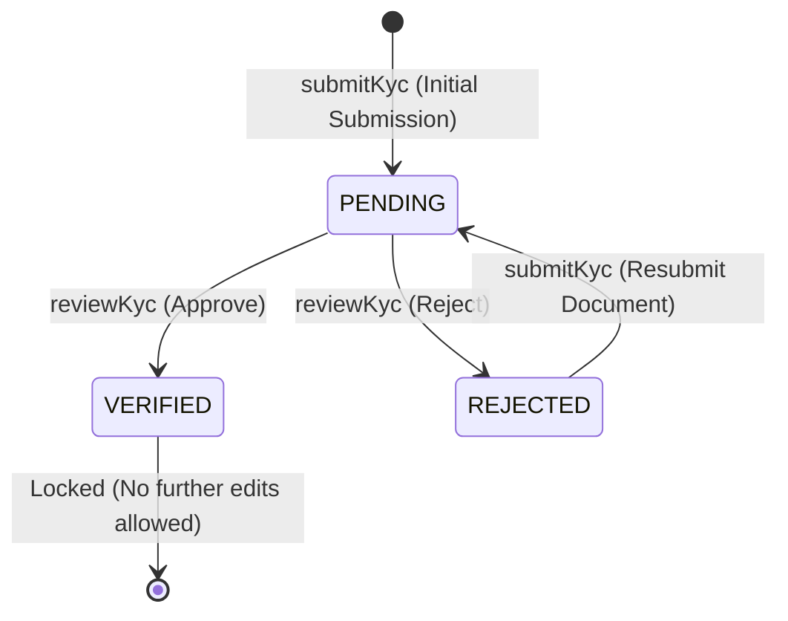
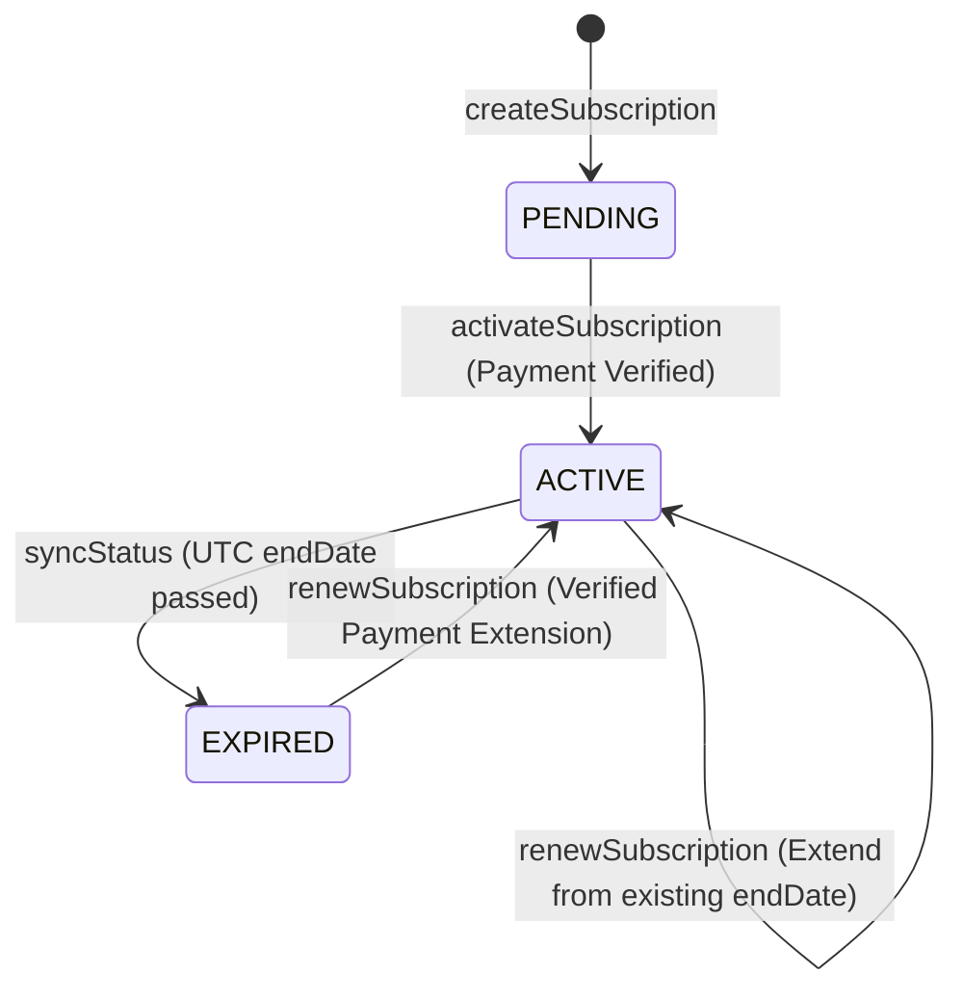

# Phase 6 — KYC + Subscription + Shop Activation + Renewal

This document details the architecture, state transitions, business rules, and security scopes implemented for the Babu Super Market / FairKart operational lifecycles.

---

## 1. State Machines

### A. KYC Document State Transitions
A KYC Document transitions through the following lifecycle.

- **PENDING**: The user has uploaded files/entered document numbers; verification is awaited.
- **VERIFIED**: The administrator has approved. Once verified, the document is locked and cannot be resubmitted or modified.
- **REJECTED**: The administrator has flagged issues. Resubmission is allowed, resetting the state to `PENDING` with cleared rejection reasons.

---

### B. Subscription State Transitions

- **PENDING**: Initial state upon plan selection. Triggers the Razorpay payment order.
- **ACTIVE**: Set upon captured payment confirmation. Validated server-side using UTC dates.
- **EXPIRED**: Triggered when the current UTC date exceeds `endDate`. Automatically transitions associated shops and shopkeepers to inactive states.

---

## 2. Shop Activation Prerequisites

A shop cannot be active unless all prerequisites are met. The backend enforces:
1. **Franchise status** is `ACTIVE`.
2. **Shopkeeper status** is `ACTIVE` or `APPROVED`.
3. **KYC status** of the shopkeeper is `APPROVED` (`VERIFIED` document).
4. **Subscription** associated with the shop or shopkeeper is `ACTIVE` (with `endDate` in the future).

If any prerequisite fails, the shop's status is automatically demoted to `EXPIRED` or `INACTIVE` to protect QR-attribution and revenue integrity.

---

## 3. Security & Territory Scoping Rules

To prevent IDOR (Insecure Direct Object Reference) and respect territory authority:
- **Shopkeeper**: Can view own KYC status, submit own KYC, and view/renew own subscriptions.
- **Taluk / District / State Franchise**:
  - Can only view/list KYC documents and subscriptions belonging to entities (Shops, Shopkeepers, lower Franchises) within their geographic boundary.
  - Checked via `territoryAccessService` matches state/district/taluk properties.
- **Admin / Super Admin**: Broad read and edit permissions (e.g., verifying KYC status, creating/cancelling plans).

---

## 4. Notifications

Persisted in-app notifications are generated during:
- **KYC Submission**: Confirmation under review.
- **KYC Review**: Approval or rejection notifications (including rejection reasons).
- **Subscription Events**: Activation, renewal, and expiration warnings.
- **Shop Status Updates**: Successful activation or suspension events.
