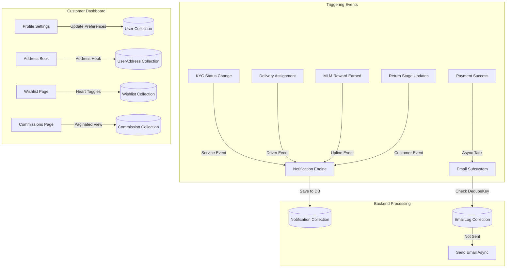

# Phase 8: Notifications, Communications, & Customer Account Experience

This document details the system design, event flows, and database schemas implemented during Phase 8 of the FairKart / Babu Super Market platform.

---

## 1. System Overview

Phase 8 introduces a comprehensive communication engine alongside a state-of-the-art user account dashboard. The objective is to keep users informed about critical transactions, referrals, KYC approvals, and return lifecycles while delivering premium account management experiences (Address Book, Security Settings, Wishlists, and Commissions).



---

## 2. Notification System & Channels

### 2.1 In-App Notifications
*   **Trigger Hooks**: Integrated inside `deliveryService.js`, `kycService.js`, `subscriptionService.js`, `mlmRewardService.js`, `fairCoinService.js`, `spinService.js`, `shopkeeperService.js`, and `returnService.js`.
*   **Retrieval & Bell Indicator**: Dynamic polling and pagination retrieve notifications under `GET /api/notifications` mapped to the Redux store (`notificationSlice.js`).
*   **Preferences Enforcement**: Channel-level toggle preferences (Order Updates, Wallet/Fair Coins, Security Alerts, and Promotional Emails) are stored in the `User` schema and respected prior to sending notifications.

### 2.2 Async Email Engine
*   **Idempotency & Deduplication**: To prevent multi-firing, all sent transactional emails record a `dedupeKey` in `EmailLog`. Duplicate calls with the same key are automatically skipped.
*   **Email Templates**: Structured, premium, responsive responsive HTML layouts designed in `templates.js` for receipts, order statuses, KYC validations, and subscription status milestones.

---

## 3. Account Experience & CRUD Abstractions

### 3.1 Profile Update (KYC Hard Lock)
To maintain security compliance, the email and phone fields on the User model are strictly locked once the user's KYC has transitioned to the `APPROVED` state.

### 3.2 Address Book Hooks
*   **Model**: `UserAddress` maps user location records.
*   **Default Flag Hook**: A Mongoose pre-save hook intercepts saving an address marked with `isDefault: true`. It automatically query-updates all other addresses owned by the same user to `isDefault: false`, maintaining exactly one default address.
*   **Auto-Fallback**: Deleting the default address triggers a post-delete handler that promotes another existing address to default.

### 3.3 Wishlist System
*   **Model**: `Wishlist` tracks array of `Product` ObjectIds.
*   **UI Toggles**: Interactive, floating Heart buttons on product cards query `/api/wishlist` to toggle item status on/off and reflect visual red fill on click.

### 3.4 MLM Commissions Page
*   **Route**: `/api/users/me/commissions` returns paginated list of MLM payout ledgers.
*   **Dashboard View**: Accessible under `/account/commissions` displaying reference order links, dates, types, and paid/reversed statuses.

---

## 4. Security & Robustness

1.  **IDOR Prevention**: All address and wishlist endpoint queries enforce query constraint mapping `{ userId: req.user._id }` preventing users from modifying other accounts' resources.
2.  **Rate Limiting**: Custom strict rate-limits are mounted in `userRoutes.js`:
    *   Profile Updates: Max 15 requests per 15 minutes.
    *   Password Changes: Max 5 requests per 15 minutes.
3.  **GDPR Compliance**: Marketing/Promotional preferences are turned OFF (`false`) by default, requiring explicit customer opt-in.

---

## 5. Verification & Testing

Verify end-to-end integration and routing by running:
```bash
npm run test:phase8 (or node scripts/testPhase8.js from the server directory)
```
This runs the full mock suite verifying:
*   User registration and KYC locks.
*   Password changes and login validation.
*   Address default state cascading.
*   In-app notification read status toggles.
*   Email idempotency checks.
*   Wishlist toggle interactions.
*   Commission pagination structures.
